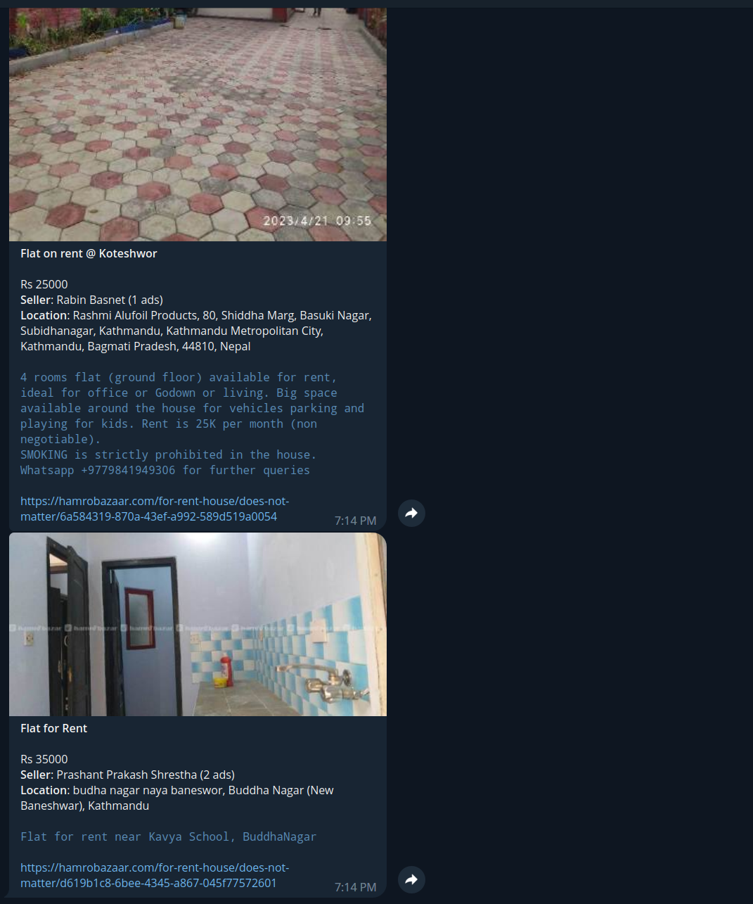

# Hamrobazar Monitor

Monitor new items on Hamrobazar and get alerted on Telegram.

## Prerequisite

1. Create a Telegram Bot and obtain the API token.

2. Find out the chat ID of the telegram user/channel/group where you want to receive the alerts.

To get the chat ID for you account, message [@RawDataBot](https://t.me/RawDataBot)

```sh
export HAMROBAZAR_TG_TOKEN="412345678"
export HAMROBAZAR_TG_CHAT_ID="xxxxxxx:xxxxxxxxxxxxxxxxxxxxxxxxxxxxxxxxx"
```

## Build 

```sh
make install
```

## Usage

```sh
hamrobazar --chat-id <chat-id> --token <bot-api-token> fixtures/flat.yaml

# If env vars are set
hamrobazar fixtures/flat.yaml
```

## Screenshots

